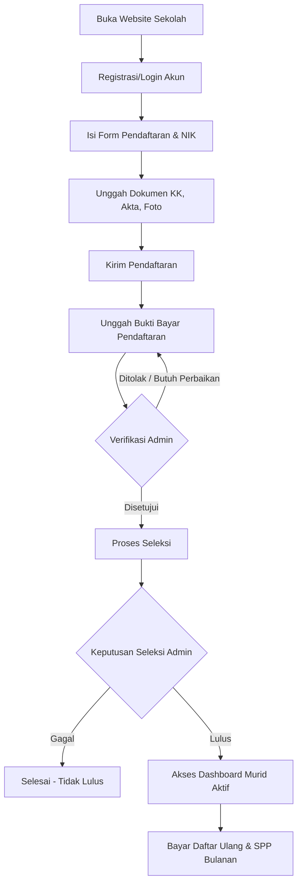
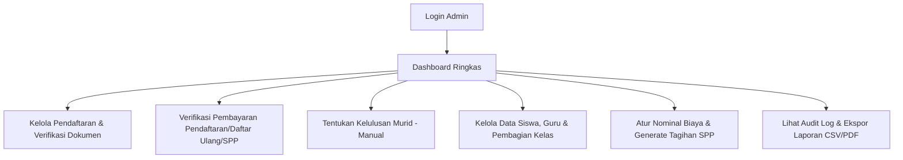
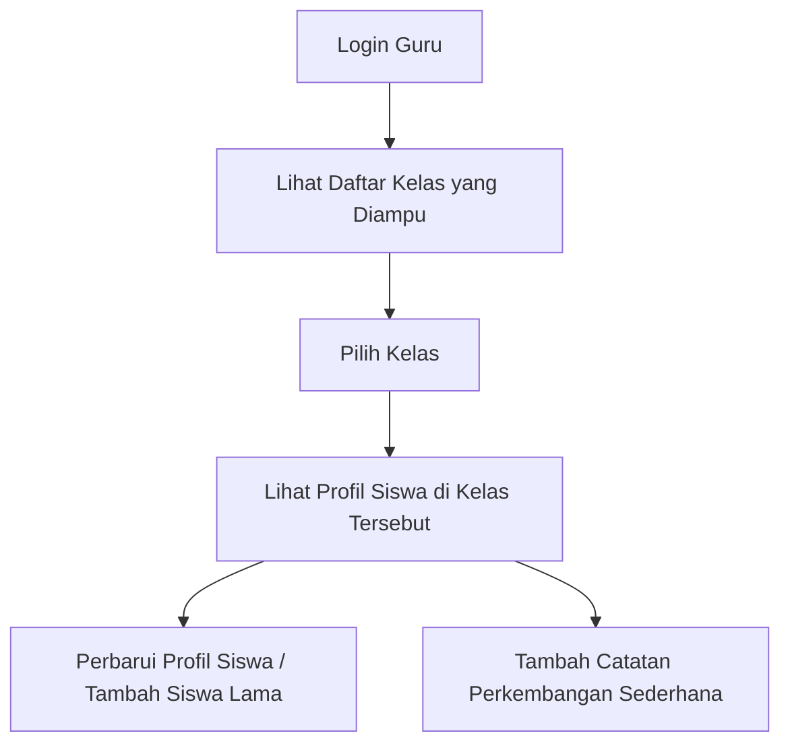
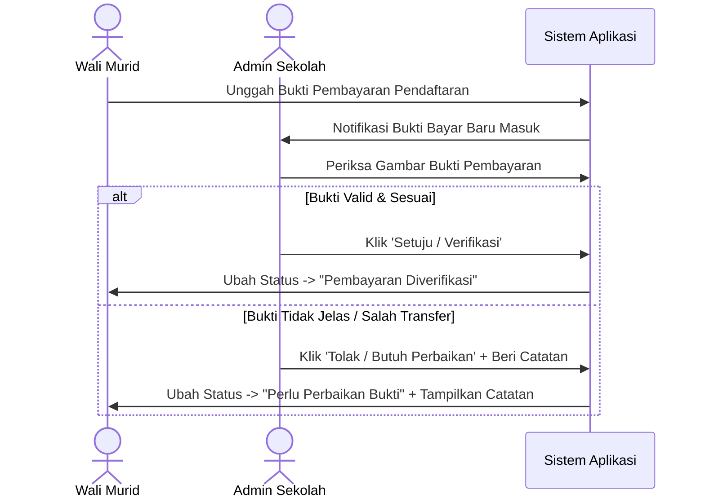
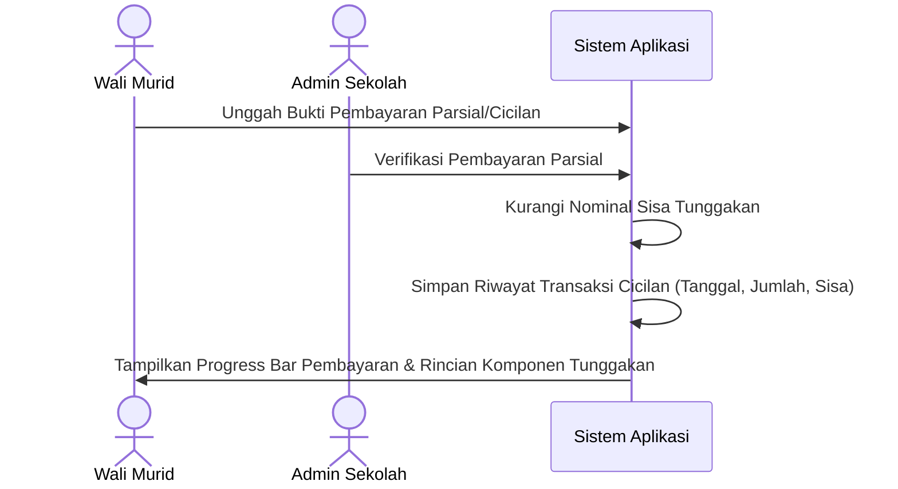
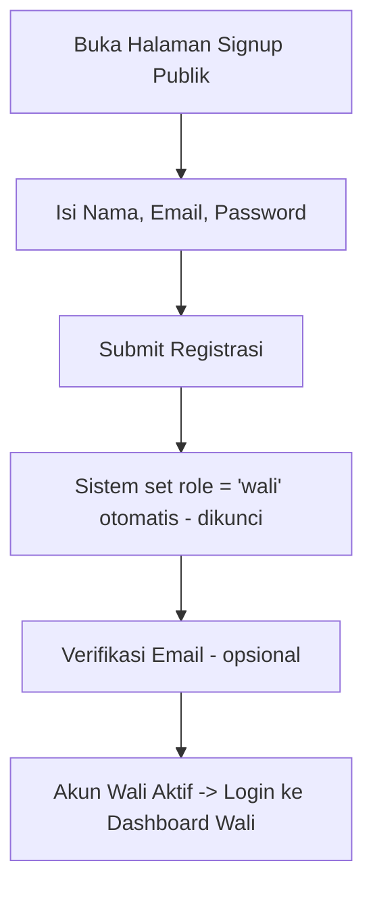
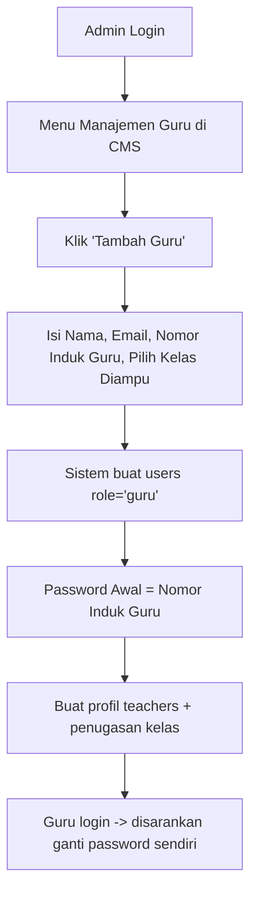
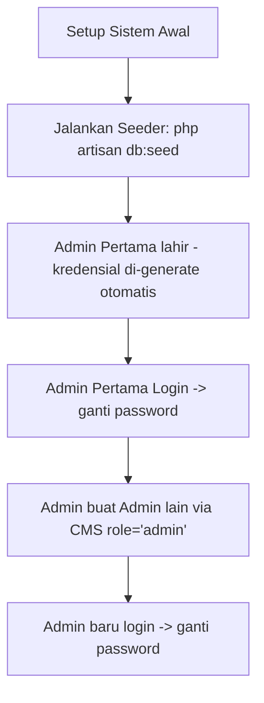
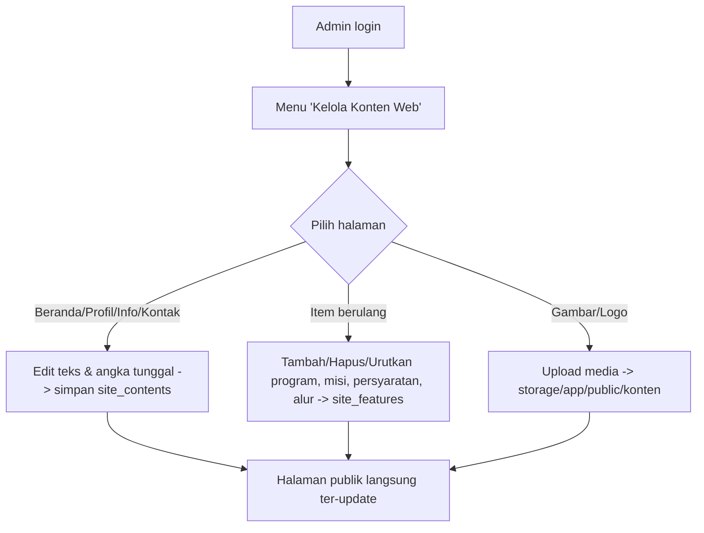

# Workflows (Alur Kerja Sistem) — RA Al Kautsar

Dokumen ini mendefinisikan alur kerja operasional dan interaksi pengguna di dalam sistem informasi RA Al Kautsar.

---

## 1. Gambaran Umum Alur Pengguna

### 1.1 Alur Wali Murid

Wali murid mengikuti alur dari pendaftaran awal hingga pembayaran SPP rutin untuk anaknya:

1. **Registrasi/Login**: Wali murid membuat akun menggunakan email aktif (yang akan menjadi email notifikasi utama).
2. **Pengisian Form & Dokumen**: Mengisi data diri, data anak (termasuk NIK wajib), serta mengunggah KK, Akta Kelahiran, dan Foto Anak.
3. **Pembayaran Biaya Pendaftaran**: Mengunggah bukti transfer biaya pendaftaran yang nominalnya diatur dinamis oleh Admin.
4. **Verifikasi & Seleksi**: Menunggu verifikasi bukti bayar oleh Admin. Setelah diverifikasi, Admin akan menentukan status kelulusan seleksi secara manual (Lulus/Gagal).
5. **Daftar Ulang & SPP**: Jika dinyatakan Lulus, wali murid dapat mengakses menu pembayaran Daftar Ulang (boleh dicicil) dan SPP bulanan (harus lunas per tagihan).

---

### 1.2 Alur Admin

Admin bertindak sebagai pengelola utama sistem dan keuangan:

1. **Verifikasi Pendaftaran**: Admin memeriksa data siswa, mengunduh/melihat dokumen pendaftaran, dan memverifikasi bukti bayar pendaftaran.
2. **Kelulusan**: Admin menentukan status lulus/gagal calon siswa secara manual melalui dashboard.
3. **Pengelolaan Data**: Admin mendaftarkan guru, membagi kelas (guru dapat mengampu banyak kelas), serta mengelola profil siswa.
4. **Manajemen Tagihan**: Admin mengatur besaran nominal biaya pendaftaran serta mengelola tagihan SPP bulanan.
5. **Laporan & Audit**: Mengunduh rekap transaksi keuangan/tunggakan dalam bentuk PDF/CSV dan memantau jejak aktivitas melalui audit log.

---

### 1.3 Alur Guru

Guru memiliki akses terbatas untuk membantu pengelolaan data siswa pada kelas yang diampunya:

1. **Akses Terbatas**: Guru login dan hanya dapat melihat daftar siswa pada kelas-kelas yang diampunya saja.
2. **Kelola Profil**: Guru dapat memperbarui data profil siswa di kelasnya atau menambahkan data siswa lama secara langsung.
3. **Catatan Perkembangan**: Guru dapat menambahkan atau memperbarui catatan perkembangan sederhana untuk siswa.
4. **Keamanan**: Guru tidak memiliki akses ke data keuangan (SPP/Daftar Ulang) maupun pengaturan sistem/role.

---

## 2. Alur Pembayaran Khusus

### 2.1 Alur Verifikasi Pembayaran Pendaftaran

---

### 2.2 Alur Pembayaran (Cicilan Daftar Ulang & Lunas SPP)

Pembayaran Daftar Ulang boleh dicicil/parsial; SPP bulanan harus lunas per tagihan. Biaya pendaftaran harus dibayar penuh.

* **Pencatatan Riwayat**: Setiap kali wali murid membayar sebagian, riwayat transaksi pembayaran tersebut dicatat sebagai transaksi parsial (tidak menimpa status keseluruhan sebelum benar-benar lunas).
* **Rincian Tunggakan**: Sistem akan menampilkan sisa tunggakan per bulan yang belum lunas secara terperinci (misal: SPP Juli: kurang Rp 50.000; SPP Agustus: kurang Rp 100.000; Daftar Ulang: kurang Rp 200.000).

---

## 3. Alur Pembuatan Akun (Auth — Opsi Satu Tabel `users` + kolom `role`)

Sistem memakai satu tabel `users` dengan kolom `role` (`wali` / `admin` / `guru`) dan RBAC via middleware. Ada 3 cara akun lahir, dengan tingkat kewenangan berbeda. *(Aturan bisnisnya lihat [rules.md](file:///d:/Laravel/Al%20Kautsar/.agents/rules.md) §1.5.)*

### 3.1 Alur Signup Wali Murid (Self-Service)

* Role dipaksa `wali` oleh sistem; form signup tidak punya pilihan role.

### 3.2 Alur Admin Membuat Akun Guru (via CMS)

* **Password awal guru = Nomor Induk Guru**. Diganti sendiri oleh guru setelah login.
* Guru tidak pernah lewat signup publik.

### 3.3 Alur Membuat Akun Admin (Multi-Admin) & Admin Pertama

* **Admin pertama** dari Seeder (mengatasi kondisi ayam & telur); kredensial di-generate otomatis lalu wajib diganti.
* Admin yang sudah ada dapat membuat Admin lain untuk membantu pengelolaan (multi-admin).

---

## 4. Alur Pengelolaan Konten Website (CMS Publik)

Operator (Admin) memperbarui informasi di halaman publik tanpa menyentuh kode (PRD §7.15, rules.md §1.8).

* **Teks/angka tunggal** disimpan sebagai key-value (`site_contents`); form menyimpan banyak key sekaligus (batch update).
* **Item berulang** (`site_features`, dibedakan `grup`): operator dapat menambah, menghapus, dan mengurutkan; hanya yang `aktif` tampil.
* **Biaya** di halaman Info TIDAK diedit di CMS konten — diambil dari pengaturan nominal keuangan (`settings`) agar satu sumber.
* **Tenaga pendidik** diatur di CMS Data Guru: Admin menandai `tampil_di_web`, mengisi `jabatan` & mengunggah foto; halaman Profil menampilkan guru tersebut dari `teachers`.
* Perubahan langsung tercermin di halaman publik pada request berikutnya (tanpa deploy ulang).
